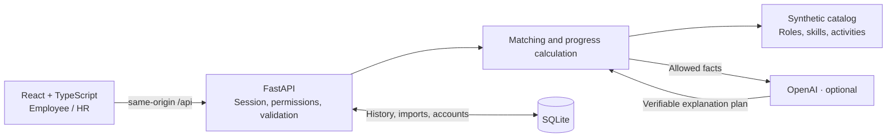

# Career Quest

[Қазақша](README.kk.md) · **English** · [Русский](README.md)

### A clear next step in your career

**HackAlem AI · Team Tebiren · working full-stack MVP**

Career Quest turns an employee's profile, target-role requirements, and learning history into **1–3 explainable development steps**. Employees see what to do next and which skills it will improve; HR sees where the team needs support.


*The actual interface running on the synthetic starter dataset. Screenshots were captured with a separate backend and a clean local database, without changing the working demo.*

[Quick start](#quick-start) · [How AI works](#how-ai-works) · [Jury demo](#jury-demo) · [Verification](#verification) · [Documentation](#documentation)

---

## Why it matters

A course catalog alone does not answer the question: "What will help me personally reach the next level?" A recommendation based only on the weakest skill also ignores career goals, skill criticality, and past participation.

Career Quest connects these data points in one workflow:

**Profile → career goal → skill gaps → next step → completion → updated progress.**

Recommendations are intended to support development. The readiness indicator **is not a promotion decision**, an assessment of an employee's value, or a prediction of employee turnover.

## How the solution works

1. **Input:** an employee profile and skill assessments, target-role requirements, an activity catalog, and participation history from JSON/CSV.
2. **User:** signs in to the application; employees open their own profiles, while HR can select another profile or import new data.
3. **Matching:** clicking Find my next step prompts the backend to check constraints, compare skills with the goal, and select up to three useful activities.
4. **Output:** the interface shows the recommendation's evidence, expected skill gains, and current readiness for the goal; an AI explanation is added when OpenAI is available.
5. **Feedback:** after a simulated completion, the backend saves the history and recalculates skills and achievements; HR sees updated participation aggregates.

## What already works

| For employees | For HR |
|---|---|
| Current role, grade, and career goal | Search and view employee profiles |
| Skill gaps and a transparent readiness calculation | The most common skill gaps |
| Up to three eligible activities with supporting evidence | Participation across all 40 activities and six statuses |
| Projected skill changes before completion | A list of employees without a next step, including reasons |
| Simulated completion, history, and saved progress | Atomic employee and history import from JSON/CSV |
| Two badges for completed activities | Demo reset with confirmation |

**Real APIs and SQLite persistence.** The normal startup does not use frontend mocks. Employees see only their own profiles; HR sees all demo profiles.

### Gamification tied to actions

- **First step** — at least one voluntary activity completed.
- **Building momentum** — three distinct voluntary activities completed.
- Completion triggers a short animation and actual changes to skills and readiness.
- Badges account for saved history. Repeats of the same activity and mandatory HR training do not increase the counter; game bonuses do not replace real calculations.

<details>
<summary>View achievements in the interface</summary>


</details>

### HR: the big picture and individual profiles


The absence of a next step is not interpreted as a lack of motivation: it may mean there is no goal, the requirements are already met, or the catalog has limitations.

## Quick start

### Requirements

- **Node.js 22.12+** and npm; verified on Node.js 24.14.1.
- **Python 3.11+**; verified on Python 3.12.14.
- Git. Internet access is needed for the initial dependency installation; OpenAI is an optional integration.

The commands below are for **Windows / PowerShell**. Run them from the repository root, where `package.json` is located.

### 1. Get the project and dependencies

```powershell
git clone https://github.com/BAITC-Hacks/hack-ee7243a5-tebiren-team.git
cd hack-ee7243a5-tebiren-team
npm ci
py -3 -m venv backend/.venv
& .\backend\.venv\Scripts\python.exe -m pip install -r backend/requirements.txt
```

If you have already cloned the repository, there is no need to clone it again.

### 2. Create local accounts

```powershell
npm run setup:demo
```

Setup asks for an employee ID (**Enter → E0002**) and two passwords of at least 12 characters each, with confirmation.

| Username | Access | Password |
|---|---|---|
| `hr` | HR dashboard, all profiles, import | Set during setup |
| `employee` | Only the selected employee profile | Set during setup |

There are no shared published passwords. The database stores salted hashes. Running setup again with confirmation replaces passwords and revokes previous sessions.

### 3. Start the application

```powershell
npm run dev
```

| Service | Address |
|---|---|
| Application | [http://127.0.0.1:5173](http://127.0.0.1:5173) |
| Backend health check | [http://127.0.0.1:8000/api/health](http://127.0.0.1:8000/api/health) |
| Swagger / OpenAPI | [http://127.0.0.1:8000/docs](http://127.0.0.1:8000/docs) |

One command starts both the frontend and backend. `Ctrl+C` stops the processes it created. If a port is occupied, check first: the application may already be running. Do not start a second instance on the same ports.

<details>
<summary>Other ports and Linux / macOS</summary>

Choose free ports in the current PowerShell session:

```powershell
$env:CQ_FRONTEND_PORT="5179"
$env:CQ_BACKEND_PORT="8010"
npm run dev
```

For Linux / macOS, after cloning:

```bash
npm ci
python3 -m venv backend/.venv
backend/.venv/bin/python -m pip install -r backend/requirements.txt
npm run setup:demo
npm run dev
```

The startup script supports these paths, but a clean Linux/macOS installation was not performed as part of the current verification.

</details>

## How AI works

The MVP uses **algorithmic matching + constrained AI explanations**. Career requirements, numeric results, and activity eligibility remain verifiable.

1. **Goal.** The backend uses the specified career goal or the next grade in the current role.
2. **Eligibility.** It checks the role, grade, required skills, session dates, history, and repeat-participation rules. Mandatory HR activities are excluded from personalized matching.
3. **Ranking.** It scores gap coverage, critical skills, similar participation history, and expected gains.
4. **Explanation.** OpenAI chooses the order and emphasis of allowed facts; the backend assembles additional text from validated evidence.
5. **Failure handling.** If the key is missing, an error occurs, the response is invalid, or a timeout is reached, algorithmic recommendations and explanations remain available.

**AI does not create new tasks, change activity rankings, skills, or grades, or make personnel decisions.** The catalog contains predefined activities; there is no HR form for adding new activities yet.

### Optional OpenAI integration

Create a local `backend/.env` using [backend/.env.example](backend/.env.example), without overwriting existing settings:

```dotenv
OPENAI_API_KEY=your_private_key_here
OPENAI_MODEL=gpt-4o-mini
```

Restart the application. Only the backend reads the key; do not add it to `VITE_...` variables, source files, or commits. Local `.env` files are excluded from Git.

Without a key, this is still **the real backend, not mock mode**. The total wait budget for an AI explanation is 7 seconds. `openai_enabled=true` in the health response confirms configuration, not a successful model request.

The separate live check uses the API and may incur charges:

```powershell
npm run check:openai
```

Private key-file setup, timeouts, and calculation details are covered in the [guide](docs/LOCAL_DEVELOPMENT.md).

## Data and integrations

**200 employees · 40 activities · 60 skills · 2,743 participation records.**

This is the hackathon's synthetic dataset. All calculations use the snapshot date **2026-10-01**, not the computer's current clock.

Source files: `employees.json`, `skills.json`, `events.json`, and `activity_history.csv`. Dataset documentation is in [dataset](dataset/README.ru.md); the backend loads its own copy from `backend/data`.

External services are **OpenAI API** for optional explanations and **Google Fonts** for interface fonts. There are no connections to a real HR system or corporate LMS. The examples in `examples/jury` are local synthetic checks, not the jury's hidden data.

- Projection and completion use the same gain formula; a course's cap cannot lower an already achieved level.
- Readiness measures coverage of the goal's requirements: critical skills have a weight of 1.5; other skills have a weight of 1.
- `Complete activity` is a **demo simulation**, not proof of course attendance or an independent knowledge assessment.
- Imports, completions, accounts, and sessions are stored in `backend/var/career-quest.sqlite3`; the original dataset files remain unchanged.
- Repeating a completion request does not award progress twice. The database is designed for **one backend process**.

### Why is there sometimes no next step?

| API reason | Meaning |
|---|---|
| `no_target` | No career goal is defined |
| `target_met` | The target role's requirements are already met |
| `no_eligible_activity` | Gaps remain, but the catalog has no eligible activity with a useful gain |

These are intentional states, not arbitrary placeholders. Searching again without changing the data does not create a new course.

## Jury demo

Allow **3–5 minutes**, using a separate or prepared local database.

1. Sign in as **HR**. Select **E0002** in the original dataset: show the career goal, readiness, and critical gaps.
2. Click **Find my next step**. Explain why a returned activity is suitable and show the skill projection.
3. Complete **one genuinely recommended step**. Compare the projection with actual changes, then show the history and achievements.
4. Open **HR overview**: overall gaps, participation, and reasons for the absence of a next step.
5. If needed, import the [test profiles](examples/jury/README.md): **E9001** — critical gaps and missed sessions; **E9002** — a cross-role transition; **E9003** — no goal.
6. Sign in as **employee** to demonstrate access to the employee's own profile only.

If activities have already been completed for your E0002, choose another profile with recommendations or prepare a separate database in advance. **Do not reset the working demo for a presentation without a backup.** Badges may already be unlocked from the original history; to demonstrate the first unlock, use a profile with no completed voluntary activities.

Import supports `employees.json` and `activity_history.csv`; importing new courses is not implemented yet. An error in any record rejects the entire import; existing IDs are not overwritten.

## Architecture



| Layer | Technologies |
|---|---|
| Interface | React, TypeScript, Vite, React Router, Recharts, CSS / SVG |
| API and business logic | Python, FastAPI, Pydantic |
| Storage | SQLite, transactions, and idempotent completions |
| AI | OpenAI Python SDK / API; `gpt-4o-mini` in the configuration example, selected through `OPENAI_MODEL`; output validation and fallback |
| Verification | pytest, Node.js test runner, TypeScript, browser checks |

```text
src/                 React UI, API client, achievements
backend/app/         API, authentication, matching, progress, and storage
backend/data/        Source dataset for the backend
backend/tests/       Automated tests and a separate fault-testing harness
tests/               Frontend gamification logic tests
dataset/             Starter dataset and hackathon documentation
examples/jury/       Synthetic profiles for demonstrating import
scripts/             Unified startup and local account setup
docs/                Requirements, acceptance reports, guide, and screenshots
```

## Verification

Latest local run: **23 September 2026**.

| Check | Result |
|---|---|
| `npm run test:backend` | **57 passed** |
| `npm run test:frontend` | **11 passed** |
| `npm run build` | TypeScript checks and the production build pass |
| Browser checks | Profile, completion, import, HR, roles, persistence, and achievements |

```powershell
npm run test:backend
npm run test:frontend
npm run build
```

Tests are isolated from the working database and do not make paid AI requests. Browser checks are described in the reports; they are **not a complete automated E2E suite**. Pytest reports one warning about a future change to Starlette's test transport; the tests pass.

A real OpenAI call was also verified separately earlier: three explanations with the `openai` source, with no changes to ranks, facts, or projections. This is the result of a specific run, not a guarantee of provider availability. Details: [core acceptance](docs/CORE_ACCEPTANCE.md) and [gamification acceptance](docs/MINI_GAMIFICATION_ACCEPTANCE.md).

## MVP boundaries and next steps

**Today:** a local demonstration with synthetic data, an English desktop-first interface, two roles, and two badges. Sessions use HttpOnly cookies, state-changing requests have CSRF protection, and secrets and the local database are excluded from the repository.

**Not implemented yet:**

- creating and editing activities through the HR dashboard;
- changing the career goal through the interface;
- LMS/HRIS integration and confirmation of actual training completion;
- SSO, production deployment, and support for multiple backend processes;
- a game economy, XP, a rewards shop, and employee leaderboards.

The immediate next step is HR catalog management, so available paths can be expanded without editing data files. The current version is not presented as a production-ready HR system.

## Deployed version

**The repository does not list a public deployment URL.** The verified way to evaluate the application is to run it locally using the instructions above: [Career Quest at 127.0.0.1:5173](http://127.0.0.1:5173). This address is accessible only on the computer running the application; it is not a public demo.

## Documentation

- [Local development: commands, access, OpenAI, formulas, and backups](docs/LOCAL_DEVELOPMENT.md)
- [Core requirements](docs/TZ_CORE_READINESS.md) and [acceptance report](docs/CORE_ACCEPTANCE.md)
- [Mini-gamification requirements](docs/TZ_MINI_GAMIFICATION.md) and [acceptance report](docs/MINI_GAMIFICATION_ACCEPTANCE.md)
- [Backend and API](backend/README.md)
- [Starter dataset description](dataset/README.ru.md)
- [Import examples for the demo](examples/jury/README.md)

---

**Tebiren · HackAlem AI**

A career goal becomes clearer when the next concrete step is visible.
