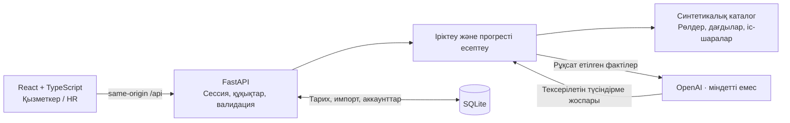

# Career Quest

**Қазақша** · [English](README.en.md) · [Русский](README.md)

### Мансаптағы түсінікті келесі қадам

**HackAlem AI · Tebiren командасы · жұмыс істейтін full-stack MVP**

Career Quest қызметкердің профилін, мақсатты рөл талаптарын және оқу тарихын **негіздемесі түсінікті 1–3 даму қадамына** айналдырады. Қызметкер әрі қарай не істеу керегін және қандай дағдыларын жақсартатынын көреді; HR командаға қай жерде қолдау қажет екенін түсінеді.


*Синтетикалық бастапқы деректер жиынымен жұмыс істейтін нақты интерфейс. Скриншоттар бөлек backend пен таза жергілікті дерекқорда түсірілген; жұмыс демосы өзгертілмеген.*

[Жылдам іске қосу](#жылдам-іске-қосу) · [AI қалай жұмыс істейді](#ai-қалай-жұмыс-істейді) · [Қазыларға арналған демо](#қазыларға-арналған-демо) · [Тексерулер](#тексерулер) · [Құжаттама](#құжаттама)

---

## Бұл не үшін қажет

Курстар каталогының өзі «Келесі деңгейге өтуге нақты маған не көмектеседі?» деген сұраққа жауап бермейді. Тек ең әлсіз дағдыға сүйенген ұсыным да мансаптық мақсатты, дағдының маңыздылығын және бұрынғы қатысуды ескермейді.

Career Quest осы деректерді бір сценарийге біріктіреді:

**Профиль → мансаптық мақсат → дағды алшақтықтары → келесі қадам → орындау → жаңарған прогресс.**

Ұсынымдар дамуға қолдау көрсетуге арналған. Дайындық көрсеткіші **қызметте жоғарылату туралы шешім, қызметкердің құндылығын бағалау немесе оның жұмыстан кетуін болжау емес**.

## Шешім қалай жұмыс істейді

1. **Кіріс деректері:** JSON/CSV файлдарынан алынған қызметкер профилі мен дағды бағалары, мақсатты рөл талаптары, іс-шаралар каталогы және қатысу тарихы.
2. **Пайдаланушы:** қосымшаға кіреді; қызметкер өз профилін ашады, ал HR басқа профильді таңдай немесе жаңа деректерді импорттай алады.
3. **Іріктеу:** Find my next step батырмасы басылғанда backend шектеулерді тексеріп, дағдыларды мақсатпен салыстырады және үшке дейін пайдалы іс-шараны таңдайды.
4. **Нәтиже:** интерфейс ұсынымның негіздемесін, күтілетін дағды өсімін және мақсатқа қазіргі дайындықты көрсетеді; OpenAI қолжетімді болса, AI түсіндірмесі қосылады.
5. **Кері байланыс:** орындауды модельдегеннен кейін backend тарихты сақтап, дағдылар мен жетістіктерді қайта есептейді; HR жаңарған қатысу жиынтықтарын көреді.

## Қазір не жұмыс істейді

| Қызметкер үшін | HR үшін |
|---|---|
| Қазіргі рөл, кәсіби деңгей және мансаптық мақсат | Қызметкерлердің профильдерін іздеу және қарау |
| Дағды алшақтықтары және дайындықты ашық есептеу | Ең жиі кездесетін дағды алшақтықтары |
| Негіздемесі бар үшке дейін сәйкес іс-шара | Барлық 40 іс-шара мен алты мәртебе бойынша қатысу |
| Орындауға дейінгі дағды өзгерісінің болжамы | Келесі қадамы жоқ қызметкерлер тізімі, себептерімен бірге |
| Орындауды модельдеу, тарих және прогресті сақтау | Қызметкерлер мен тарихты JSON/CSV арқылы атомарлық импорттау |
| Аяқталған іс-шаралар үшін екі бейдж | Растаудан кейін демоны бастапқы күйге қайтару |

**Нақты API және SQLite-та сақтау.** Қалыпты іске қосу frontend mock-тарын пайдаланбайды. Қызметкер тек өзін, HR демодағы барлық профильді көреді.

### Әрекеттермен байланысты геймификация

- **First step** — кемінде бір ерікті іс-шара аяқталған.
- **Building momentum** — үш түрлі ерікті іс-шара аяқталған.
- Орындаудан кейін — қысқа анимация және дағдылар мен дайындықтың нақты өзгерісі.
- Бейдждер сақталған тарихты ескереді. Бір іс-шараны қайталау және міндетті HR оқуы есептегішті арттырмайды; ойын бонустары нақты есептеулерді алмастырмайды.

<details>
<summary>Интерфейстегі жетістіктерді қарау</summary>


</details>

### HR: жалпы көрініс және нақты профильдер


Келесі қадамның болмауы ынтаның жоқтығы деп түсіндірілмейді: оның себебі мақсаттың болмауы, талаптардың орындалып қоюы немесе каталогтың шектеулілігі болуы мүмкін.

## Жылдам іске қосу

### Талаптар

- **Node.js 22.12+** және npm; Node.js 24.14.1 нұсқасында тексерілген.
- **Python 3.11+**; Python 3.12.14 нұсқасында тексерілген.
- Git. Тәуелділіктерді бастапқы орнату үшін интернет қажет; OpenAI — міндетті емес интеграция.

Төмендегі пәрмендер **Windows / PowerShell** үшін берілген. Оларды `package.json` орналасқан репозиторий түбірінен орындаңыз.

### 1. Жобаны және тәуелділіктерді алу

```powershell
git clone https://github.com/BAITC-Hacks/hack-ee7243a5-tebiren-team.git
cd hack-ee7243a5-tebiren-team
npm ci
py -3 -m venv backend/.venv
& .\backend\.venv\Scripts\python.exe -m pip install -r backend/requirements.txt
```

Репозиторий бұрын клондалған болса, қайта клондау қажет емес.

### 2. Жергілікті аккаунттарды жасау

```powershell
npm run setup:demo
```

Баптау қызметкер ID-сін (**Enter → E0002**) және әрқайсысы кемінде 12 таңбадан тұратын, растауы бар екі парольді сұрайды.

| Логин | Қолжетімділік | Пароль |
|---|---|---|
| `hr` | HR панелі, барлық профильдер, импорт | Баптау кезінде беріледі |
| `employee` | Тек таңдалған қызметкер профилі | Баптау кезінде беріледі |

Жарияланған ортақ парольдер жоқ. Дерекқорда salt қосылған хештер сақталады. Растаумен қайта баптау парольдерді ауыстырып, бұрынғы сессиялардың күшін жояды.

### 3. Қосымшаны іске қосу

```powershell
npm run dev
```

| Сервис | Мекенжай |
|---|---|
| Қосымша | [http://127.0.0.1:5173](http://127.0.0.1:5173) |
| Backend тексеруі | [http://127.0.0.1:8000/api/health](http://127.0.0.1:8000/api/health) |
| Swagger / OpenAPI | [http://127.0.0.1:8000/docs](http://127.0.0.1:8000/docs) |

Бір пәрмен frontend пен backend-ты іске қосады. `Ctrl+C` осы пәрмен жасаған процестерді тоқтатады. Порт бос болмаса, алдымен тексеріңіз: қосымша іске қосылып тұрған болуы мүмкін. Сол порттарда екінші дананы іске қоспаңыз.

<details>
<summary>Басқа порттар және Linux / macOS</summary>

Қазіргі PowerShell сессиясында бос порттарды көрсету:

```powershell
$env:CQ_FRONTEND_PORT="5179"
$env:CQ_BACKEND_PORT="8010"
npm run dev
```

Клондаудан кейін Linux / macOS үшін:

```bash
npm ci
python3 -m venv backend/.venv
backend/.venv/bin/python -m pip install -r backend/requirements.txt
npm run setup:demo
npm run dev
```

Іске қосу скрипті бұл жолдарды қолдайды, бірақ осы тексеру аясында Linux/macOS-та таза ортаға орнату жүргізілмеген.

</details>

## AI қалай жұмыс істейді

MVP-де **алгоритмдік іріктеу + шектеулі AI түсіндірмесі** қолданылады. Мансаптық талаптар, сандар және іс-шараға қатысуға жарамдылық тексерілетін болып қалады.

1. **Мақсат.** Backend берілген мансаптық мақсатты немесе қазіргі рөлдің келесі кәсіби деңгейін пайдаланады.
2. **Қатысу шарттары.** Рөлді, кәсіби деңгейді, қажетті дағдыларды, сессия күндерін, тарихты және қайта қатысу мүмкіндігін тексереді. Міндетті HR іс-шаралары жеке іріктеуге кірмейді.
3. **Ранжирлеу.** Алшақтықтардың қамтылуын, маңызды дағдыларды, ұқсас қатысу тарихын және күтілетін өсімді бағалайды.
4. **Түсіндірме.** OpenAI рұқсат етілген фактілердің ретін және екпінін таңдайды; backend қосымша мәтінді тексерілген негіздемелерден құрастырады.
5. **Ақаулардан қорғаныс.** Кілт болмағанда, қате, жарамсыз жауап немесе таймаут туындағанда алгоритмдік ұсынымдар мен түсіндірмелер сақталады.

**AI жаңа тапсырмалар жасамайды, іс-шаралардың рейтингін, дағдыларды немесе кәсіби деңгейді өзгертпейді және кадрлық шешімдер қабылдамайды.** Каталогта алдын ала сипатталған іс-шаралар бар; HR үшін жаңа іс-шара қосу формасы әзірге жоқ.

### OpenAI қосу — міндетті емес

Бар баптауларды қайта жазбай, [backend/.env.example](backend/.env.example) үлгісі бойынша жергілікті `backend/.env` жасаңыз:

```dotenv
OPENAI_API_KEY=your_private_key_here
OPENAI_MODEL=gpt-4o-mini
```

Қосымшаны қайта іске қосыңыз. Кілтті тек backend оқиды; оны `VITE_...` айнымалыларына, бастапқы кодқа немесе коммиттерге қоспаңыз. Жергілікті `.env` файлдары Git-тен шығарылған.

Кілтсіз де бұл **mock-режим емес, нақты backend** болып қалады. AI түсіндірмесін күтудің жалпы шегі — 7 секунд. Health жауабындағы `openai_enabled=true` баптаудың барын растайды, бірақ модельге сұраудың сәтті орындалғанын білдірмейді.

Бөлек live-тексеру API-ды пайдаланады және қаражат жұмсауы мүмкін:

```powershell
npm run check:openai
```

Кілтті құпия файл арқылы баптау, таймауттар және есептеу егжей-тегжейлері [нұсқаулықта](docs/LOCAL_DEVELOPMENT.md) берілген.

## Деректер және интеграциялар

**200 қызметкер · 40 іс-шара · 60 дағды · 2 743 қатысу жазбасы.**

Бұл — хакатонның синтетикалық деректер жиыны. Барлық есептеулер компьютердің қазіргі уақытына емес, **2026-10-01** есептік күніне байланған.

Бастапқы файлдар: `employees.json`, `skills.json`, `events.json` және `activity_history.csv`. Жиын құжаттамасы [dataset](dataset/README.ru.md) ішінде, ал backend өз көшірмесін `backend/data` ішінен жүктейді.

Сыртқы сервистерден қосымша түсіндірме үшін **OpenAI API**, интерфейс қаріптері үшін **Google Fonts** қолданылады. Нақты кадрлық жүйеге немесе корпоративтік LMS-ке қосылым жоқ. `examples/jury` ішіндегі мысалдар — жергілікті синтетикалық тексерулер, қазылардың жасырын деректері емес.

- Болжам мен орындау бір өсім формуласын қолданады; курстың шекті деңгейі бұрын жеткен деңгейді төмендете алмайды.
- Дайындық мақсат талаптарының қамтылуын көрсетеді: маңызды дағдылардың салмағы — 1.5, қалғандарынікі — 1.
- `Complete activity` — курсқа қатысуды растау немесе білімді тәуелсіз бағалау емес, **демо-симуляция**.
- Импорт, орындаулар, аккаунттар және сессиялар `backend/var/career-quest.sqlite3` ішінде сақталады; бастапқы деректер файлдары өзгермейді.
- Бір орындау сұрауын қайталау прогресті екі рет қоспайды. Дерекқор **бір backend процесіне** арналған.

### Неліктен кейде келесі қадам жоқ?

| API себебі | Мағынасы |
|---|---|
| `no_target` | Мансаптық мақсат анықталмаған |
| `target_met` | Мақсатты рөл талаптары орындалған |
| `no_eligible_activity` | Алшақтықтар бар, бірақ каталогта пайдалы өсім беретін, қатысу шарттарына сай іс-шара жоқ |

Бұлар — кездейсоқ толтырғыштар емес, қарастырылған күйлер. Деректерді өзгертпей қайта іздеу жаңа курс жасамайды.

## Қазыларға арналған демо

Ұсынылатын ұзақтық — **3–5 минут**, бөлек немесе алдын ала дайындалған жергілікті дерекқорда.

1. **HR** ретінде кіру. Бастапқы жиында **E0002** таңдап, мансаптық мақсатты, дайындықты және маңызды алшақтықтарды көрсету.
2. **Find my next step** басу. Ұсынылған іс-шараның неге сәйкес келетінін түсіндіріп, дағды болжамын көрсету.
3. **Шынымен ұсынылған бір қадамды** орындау. Болжамды нақты өзгерістермен салыстырып, тарих пен жетістіктерді көрсету.
4. **HR overview** ашу: жалпы алшақтықтар, қатысу және келесі қадамның болмау себептері.
5. Қажет болса, [тексеру профильдерін](examples/jury/README.md) импорттау: **E9001** — маңызды алшақтықтар мен қатыспай қалу, **E9002** — басқа рөлге ауысу, **E9003** — мақсаттың болмауы.
6. Тек өз профиліне қолжетімділікті көрсету үшін **employee** ретінде кіру.

Егер сіздің E0002 профиліңіздегі іс-шаралар орындалып қойған болса, ұсынымдары бар басқа профильді таңдаңыз немесе бөлек дерекқорды алдын ала дайындаңыз. **Көрсетілім үшін жұмыс демосын сақтық көшірмесіз бастапқы күйге қайтармаңыз.** Бастапқы тарих бойынша бейдждер бірден ашық болуы мүмкін; алғашқы ашылуды көрсету үшін аяқталған ерікті іс-шаралары жоқ профиль қажет.

Импорт `employees.json` және `activity_history.csv` файлдарын қолдайды; импорт арқылы жаңа курстар қосу әзірге іске асырылмаған. Кез келген жазбадағы қате бүкіл импортты тоқтатады, бар ID-лер қайта жазылмайды.

## Архитектура



| Қабат | Технологиялар |
|---|---|
| Интерфейс | React, TypeScript, Vite, React Router, Recharts, CSS / SVG |
| API және бизнес-логика | Python, FastAPI, Pydantic |
| Сақтау | SQLite, транзакциялар және идемпотентті орындаулар |
| AI | OpenAI Python SDK / API; баптау үлгісінде `gpt-4o-mini`, `OPENAI_MODEL` арқылы таңдау; нәтижені тексеру және резервтік режим |
| Тексерулер | pytest, Node.js test runner, TypeScript, браузердегі тексерулер |

```text
src/                 React UI, API клиенті, жетістіктер
backend/app/         API, авторизация, іріктеу, прогресс және сақтау
backend/data/        Backend үшін бастапқы деректер жиыны
backend/tests/       Автоматты тесттер және бөлек ақау сынақ стенді
tests/               Геймификация логикасының frontend тексерулері
dataset/             Бастапқы жиын және хакатон құжаттамасы
examples/jury/       Импортты көрсетуге арналған синтетикалық профильдер
scripts/             Бірыңғай іске қосу және жергілікті аккаунттарды баптау
docs/                Техникалық тапсырмалар, тексеру есептері, нұсқаулық және скриншоттар
```

## Тексерулер

Соңғы жергілікті тексеру — **2026 жылғы 23 қыркүйек**:

| Тексеру | Нәтиже |
|---|---|
| `npm run test:backend` | **57 passed** |
| `npm run test:frontend` | **11 passed** |
| `npm run build` | TypeScript тексеруі және production-құрастыру сәтті |
| Браузердегі тексерулер | Профиль, орындау, импорт, HR, рөлдер, сақтау және жетістіктер |

```powershell
npm run test:backend
npm run test:frontend
npm run build
```

Тесттер жұмыс дерекқорынан оқшауланған және ақылы AI сұрауларын орындамайды. Браузердегі тексерулер есептерде сипатталған; бұл — **толық автоматты E2E жиыны емес**. Pytest-та Starlette тесттік тасымалдау механизмі болашақта өзгеретіні туралы бір ескерту бар; тесттер сәтті өтеді.

Бұған дейін OpenAI-дың нақты шақыруы бөлек тексерілген: көзі `openai` деп көрсетілген үш түсіндірме алынып, ранктер, фактілер мен болжам өзгермеген. Бұл — провайдердің қолжетімділігіне кепілдік емес, нақты бір тексерудің нәтижесі. Толығырақ: [негізгі тексеру](docs/CORE_ACCEPTANCE.md) және [геймификацияны тексеру](docs/MINI_GAMIFICATION_ACCEPTANCE.md).

## MVP шектеулері және келесі қадамдар

**Қазір:** синтетикалық деректердегі жергілікті демонстрация, ағылшын тіліндегі, алдымен компьютер экранына арналған интерфейс, екі рөл және екі бейдж. Сессиялар HttpOnly cookie пайдаланады, өзгертуші сұраулар CSRF арқылы қорғалған; құпия мәндер мен жергілікті дерекқор репозиторийге кірмейді.

**Әлі іске асырылмаған:**

- HR панелі арқылы іс-шараларды жасау және өңдеу;
- интерфейс арқылы мансаптық мақсатты өзгерту;
- LMS/HRIS интеграциясы және оқуды нақты аяқтауды растау;
- SSO, production ортасына орналастыру, бірнеше backend процесін қолдау;
- ойын экономикасы, XP, марапаттар дүкені және қызметкерлер рейтингтері.

Ең жақын келесі қадам — деректер файлдарын өзгертпей қолжетімді жолдарды кеңейту үшін HR-ға каталогты басқару мүмкіндігін беру. Қазіргі нұсқа дайын өндірістік кадрлық жүйе ретінде ұсынылмайды.

## Жарияланған нұсқа

**Репозиторийде жалпыға ашық жарияланған нұсқаның сілтемесі көрсетілмеген.** Расталған тексеру тәсілі — жоғарыдағы нұсқаулық бойынша жергілікті іске қосу: [Career Quest — 127.0.0.1:5173](http://127.0.0.1:5173). Бұл мекенжай тек қосымша іске қосылған компьютерде қолжетімді; ол жалпыға ашық демо емес.

## Құжаттама

- [Жергілікті әзірлеу: пәрмендер, қолжетімділік, OpenAI, формулалар, сақтық көшірмелер](docs/LOCAL_DEVELOPMENT.md)
- [Негізгі техникалық тапсырма](docs/TZ_CORE_READINESS.md) және [тексеру есебі](docs/CORE_ACCEPTANCE.md)
- [Мини-геймификацияның техникалық тапсырмасы](docs/TZ_MINI_GAMIFICATION.md) және [тексеру есебі](docs/MINI_GAMIFICATION_ACCEPTANCE.md)
- [Backend және API](backend/README.md)
- [Бастапқы деректер жиынының сипаттамасы](dataset/README.ru.md)
- [Демонстрацияға арналған импорт мысалдары](examples/jury/README.md)

---

**Tebiren · HackAlem AI**

Келесі нақты қадам көрінгенде, мансаптық мақсат та түсініктірек болады.
