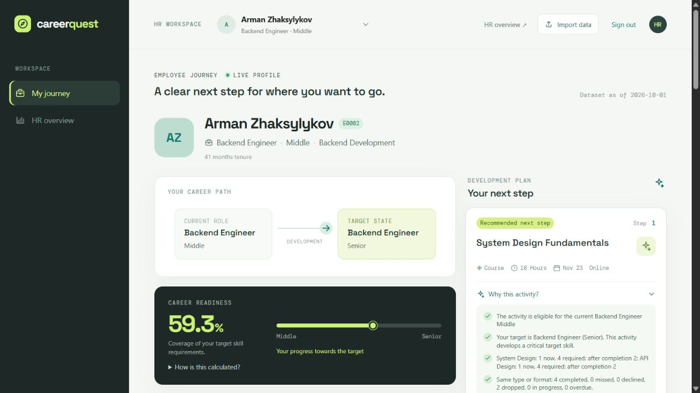
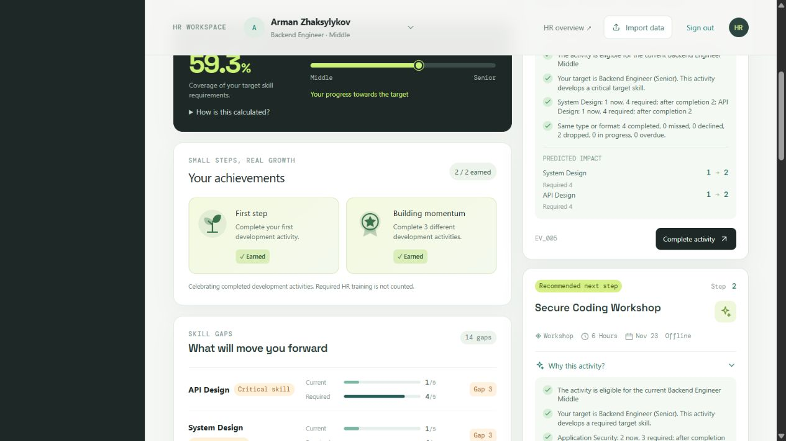
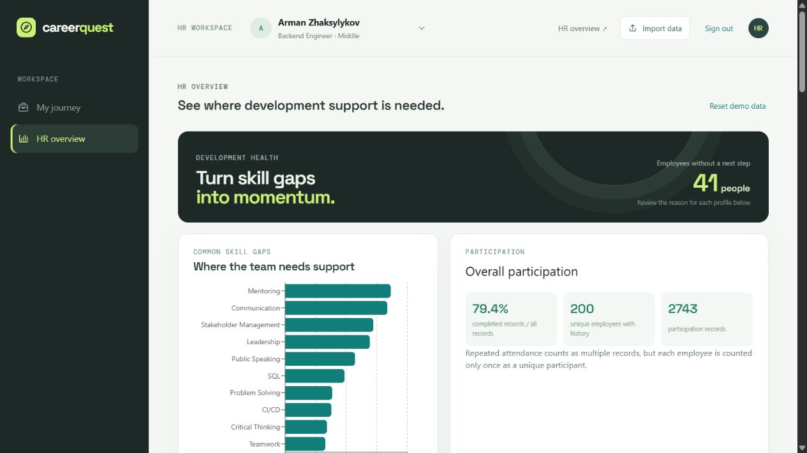
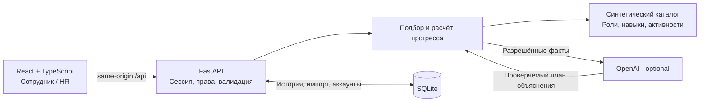

# Career Quest

[Қазақша](README.kk.md) · [English](README.en.md) · **Русский**

### Понятный следующий шаг в карьере

**HackAlem AI · команда Tebiren · работающий full-stack MVP**

Career Quest превращает профиль сотрудника, требования целевой роли и историю обучения в **1–3 объяснимых шага развития**. Сотрудник видит, что делать дальше и какие навыки это улучшит; HR — где команде нужна поддержка.



*Реальный интерфейс на синтетическом стартовом наборе. Скриншоты сняты с отдельным backend и чистой локальной базой, без изменения рабочего демо.*

[Быстрый запуск](#быстрый-запуск) · [Как работает AI](#как-работает-ai) · [Демо для жюри](#демо-для-жюри) · [Проверки](#проверки) · [Документация](#документация)

---

## Зачем это нужно

Каталог курсов сам по себе не отвечает на вопрос: «Что поможет именно мне перейти на следующий уровень?» Рекомендация только по самому слабому навыку тоже не учитывает карьерную цель, критичность навыка и прошлое участие.

Career Quest связывает эти данные в один сценарий:

**Профиль → карьерная цель → разрывы навыков → следующий шаг → выполнение → обновлённый прогресс.**

Рекомендации предназначены для поддержки развития. Показатель готовности **не является решением о повышении**, оценкой ценности сотрудника или прогнозом его увольнения.

## Как работает решение

1. **Входные данные:** профиль сотрудника и оценки навыков, требования целевой роли, каталог активностей и история участия из JSON/CSV.
2. **Пользователь:** входит в приложение; сотрудник открывает свой профиль, HR может выбрать другой профиль или импортировать новые данные.
3. **Подбор:** по кнопке Find my next step backend проверяет ограничения, сопоставляет навыки с целью и выбирает до трёх полезных активностей.
4. **Результат:** интерфейс показывает основания рекомендации, ожидаемый прирост навыков и текущую готовность к цели; при доступном OpenAI добавляется AI-объяснение.
5. **Обратная связь:** после симуляции выполнения backend сохраняет историю, пересчитывает навыки и достижения; HR видит обновлённые агрегаты участия.

## Что уже работает

| Для сотрудника | Для HR |
|---|---|
| Текущая роль, грейд и карьерная цель | Поиск и просмотр профилей сотрудников |
| Разрывы навыков и прозрачный расчёт готовности | Наиболее распространённые разрывы навыков |
| До трёх подходящих активностей с основаниями | Участие по всем 40 активностям и шести статусам |
| Прогноз изменения навыков до выполнения | Список сотрудников без следующего шага с причинами |
| Симуляция выполнения, история и сохранение прогресса | Атомарный импорт сотрудников и истории из JSON/CSV |
| Два значка за завершённые активности | Сброс демо с подтверждением |

**Реальные API и сохранение в SQLite.** Обычный запуск не использует frontend-моки. Сотрудник видит только себя, HR — все профили демо.

### Геймификация, связанная с действиями

- **First step** — завершена хотя бы одна добровольная активность.
- **Building momentum** — завершены три разные добровольные активности.
- После выполнения — короткая анимация и фактическое изменение навыков и готовности.
- Значки учитывают сохранённую историю. Повторы одной активности и обязательное HR-обучение не увеличивают счётчик; игровые бонусы не подменяют реальные расчёты.

<details>
<summary>Посмотреть достижения в интерфейсе</summary>



</details>

### HR: общая картина и конкретные профили



Отсутствие следующего шага не интерпретируется как отсутствие мотивации: это может быть отсутствие цели, уже выполненные требования или ограничение каталога.

## Быстрый запуск

### Требования

- **Node.js 22.12+** и npm; проверено на Node.js 24.14.1.
- **Python 3.11+**; проверено на Python 3.12.14.
- Git. Интернет нужен для первоначальной установки зависимостей; OpenAI — необязательная интеграция.

Команды ниже — для **Windows / PowerShell**. Выполняйте их из корня репозитория, где находится `package.json`.

### 1. Получить проект и зависимости

```powershell
git clone https://github.com/BAITC-Hacks/hack-ee7243a5-tebiren-team.git
cd hack-ee7243a5-tebiren-team
npm ci
py -3 -m venv backend/.venv
& .\backend\.venv\Scripts\python.exe -m pip install -r backend/requirements.txt
```

Если репозиторий уже склонирован, повторное клонирование не нужно.

### 2. Создать локальные аккаунты

```powershell
npm run setup:demo
```

Настройка попросит ID сотрудника (**Enter → E0002**) и два пароля длиной не менее 12 символов с подтверждением.

| Логин | Доступ | Пароль |
|---|---|---|
| `hr` | HR-панель, все профили, импорт | Задаётся при настройке |
| `employee` | Только выбранный профиль сотрудника | Задаётся при настройке |

Общих опубликованных паролей нет. В базе сохраняются солёные хеши. Повторная настройка с подтверждением заменяет пароли и отзывает прежние сессии.

### 3. Запустить приложение

```powershell
npm run dev
```

| Сервис | Адрес |
|---|---|
| Приложение | [http://127.0.0.1:5173](http://127.0.0.1:5173) |
| Проверка backend | [http://127.0.0.1:8000/api/health](http://127.0.0.1:8000/api/health) |
| Swagger / OpenAPI | [http://127.0.0.1:8000/docs](http://127.0.0.1:8000/docs) |

Одна команда запускает frontend и backend. `Ctrl+C` останавливает созданные ею процессы. Если порт занят, сначала проверьте: возможно, приложение уже работает. Не запускайте второй экземпляр на тех же портах.

<details>
<summary>Другие порты и Linux / macOS</summary>

Свободные порты в текущем PowerShell:

```powershell
$env:CQ_FRONTEND_PORT="5179"
$env:CQ_BACKEND_PORT="8010"
npm run dev
```

Для Linux / macOS после клонирования:

```bash
npm ci
python3 -m venv backend/.venv
backend/.venv/bin/python -m pip install -r backend/requirements.txt
npm run setup:demo
npm run dev
```

Скрипт запуска поддерживает эти пути, но чистая установка на Linux/macOS в рамках текущей проверки не выполнялась.

</details>

## Как работает AI

В MVP используется **алгоритмический подбор + ограниченное AI-объяснение**. Карьерные требования, числа и допустимость активности остаются проверяемыми.

1. **Цель.** Backend использует указанную карьерную цель или следующий грейд текущей роли.
2. **Допустимость.** Проверяет роль, грейд, необходимые навыки, даты сессий, историю и возможность повторного участия. Обязательные HR-мероприятия исключены из персонального подбора.
3. **Ранжирование.** Оценивает покрытие разрывов, критичные навыки, похожую историю участия и ожидаемый прирост.
4. **Объяснение.** OpenAI выбирает порядок разрешённых фактов и акцент; backend собирает дополнительный текст из проверенных оснований.
5. **Защита от сбоев.** При отсутствии ключа, ошибке, недопустимом ответе или таймауте сохраняются алгоритмические рекомендации и объяснения.

**AI не создаёт новые задания, не меняет рейтинг активностей, навыки или грейд и не принимает кадровых решений.** Каталог содержит заранее описанные активности; формы добавления новых активностей для HR пока нет.

### Подключение OpenAI — необязательно

Создайте локальный `backend/.env` по образцу [backend/.env.example](backend/.env.example), не перезаписывая существующие настройки:

```dotenv
OPENAI_API_KEY=your_private_key_here
OPENAI_MODEL=gpt-4o-mini
```

Перезапустите приложение. Ключ читает только backend; не добавляйте его в переменные `VITE_...`, исходники или коммиты. Локальные `.env` исключены из Git.

Без ключа это по-прежнему **реальный backend, а не mock-режим**. Общий бюджет ожидания AI-объяснения — 7 секунд. `openai_enabled=true` в health подтверждает наличие конфигурации, но не успешный запрос к модели.

Отдельная live-проверка использует API и может расходовать средства:

```powershell
npm run check:openai
```

Настройка ключа через приватный файл, таймауты и детали расчётов — в [руководстве](docs/LOCAL_DEVELOPMENT.md).

## Данные и интеграции

**200 сотрудников · 40 активностей · 60 навыков · 2 743 записи участия.**

Это синтетический набор хакатона. Все расчёты привязаны к дате снимка **2026-10-01**, а не к текущим часам компьютера.

Исходные файлы: `employees.json`, `skills.json`, `events.json` и `activity_history.csv`. Документация набора находится в [dataset](dataset/README.ru.md), backend загружает свою копию из `backend/data`.

Из внешних сервисов используются **OpenAI API** для необязательного объяснения и **Google Fonts** для шрифтов интерфейса. Подключений к реальной кадровой системе или корпоративной LMS нет. Примеры в `examples/jury` — локальные синтетические проверки, не скрытые данные жюри.

- Прогноз и выполнение используют одну формулу прироста; потолок курса не может снизить уже достигнутый уровень.
- Готовность отражает покрытие требований цели: критичные навыки имеют вес 1.5, остальные — 1.
- `Complete activity` — **демо-симуляция**, не подтверждение посещения курса или независимая оценка знаний.
- Импорт, выполнения, аккаунты и сессии сохраняются в `backend/var/career-quest.sqlite3`; исходные файлы набора не изменяются.
- Повтор одного запроса выполнения не начисляет прогресс дважды. База рассчитана на **один процесс backend**.

### Почему иногда нет следующего шага?

| Причина API | Значение |
|---|---|
| `no_target` | Карьерная цель не определена |
| `target_met` | Требования целевой роли уже выполнены |
| `no_eligible_activity` | Разрывы остались, но в каталоге нет допустимой активности с полезным приростом |

Это предусмотренные состояния, а не случайные заглушки. Повторный поиск без изменения данных не создаёт новый курс.

## Демо для жюри

Ориентир — **3–5 минут**, на отдельной или заранее подготовленной локальной базе.

1. Войти как **HR**. На исходном наборе выбрать **E0002**: показать карьерную цель, готовность и критичные разрывы.
2. Нажать **Find my next step**. Объяснить, почему возвращённая активность подходит, и показать прогноз навыков.
3. Выполнить **один действительно предложенный шаг**. Сопоставить прогноз с фактическими изменениями, показать историю и достижения.
4. Открыть **HR overview**: общие разрывы, участие и причины отсутствия следующего шага.
5. При необходимости импортировать [проверочные профили](examples/jury/README.md): **E9001** — критичные разрывы и пропуски, **E9002** — переход в другую роль, **E9003** — отсутствие цели.
6. Войти как **employee**, чтобы показать доступ только к собственному профилю.

Если на вашем E0002 активности уже выполнены, выберите другой профиль с рекомендациями или заранее подготовьте отдельную БД. **Не сбрасывайте рабочее демо ради показа без резервной копии.** Значки за исходную историю могут быть открыты сразу; для показа первого открытия нужен профиль без завершённых добровольных активностей.

Импорт поддерживает `employees.json` и `activity_history.csv`; добавление новых курсов через импорт пока не реализовано. Ошибка любой записи отменяет весь импорт, существующие ID не перезаписываются.

## Архитектура



| Слой | Технологии |
|---|---|
| Интерфейс | React, TypeScript, Vite, React Router, Recharts, CSS / SVG |
| API и бизнес-логика | Python, FastAPI, Pydantic |
| Хранение | SQLite, транзакции и идемпотентные выполнения |
| AI | OpenAI Python SDK / API; `gpt-4o-mini` в примере конфигурации, выбор через `OPENAI_MODEL`; проверка результата и fallback |
| Проверки | pytest, Node.js test runner, TypeScript, проверки браузера |

```text
src/                 React UI, API-клиент, достижения
backend/app/         API, авторизация, подбор, прогресс и хранение
backend/data/        Исходный набор для backend
backend/tests/       Автоматические тесты и отдельный fault-стенд
tests/               Frontend-проверки логики геймификации
dataset/             Стартовый набор и документация хакатона
examples/jury/       Синтетические профили для демонстрации импорта
scripts/             Единый запуск и настройка локальных аккаунтов
docs/                ТЗ, отчёты проверки, руководство и скриншоты
```

## Проверки

Последний локальный прогон **23 сентября 2026**:

| Проверка | Результат |
|---|---|
| `npm run test:backend` | **57 passed** |
| `npm run test:frontend` | **11 passed** |
| `npm run build` | TypeScript и production-сборка проходят |
| Проверки браузера | Профиль, выполнение, импорт, HR, роли, сохранение и достижения |

```powershell
npm run test:backend
npm run test:frontend
npm run build
```

Тесты изолированы от рабочей базы и не выполняют платных AI-запросов. Проверки браузера описаны в отчётах; это **не полный автоматический E2E-набор**. В pytest есть одно предупреждение о будущем изменении тестового транспорта Starlette; тесты проходят.

Ранее отдельно проверен настоящий вызов OpenAI: три объяснения с источником `openai`, без изменения рангов, фактов и прогноза. Это результат конкретного прогона, а не гарантия доступности провайдера. Подробности: [основная проверка](docs/CORE_ACCEPTANCE.md) и [проверка геймификации](docs/MINI_GAMIFICATION_ACCEPTANCE.md).

## Границы MVP и следующие шаги

**Сейчас:** локальная демонстрация на синтетических данных, англоязычный desktop-first интерфейс, две роли и два значка. Сессии используют HttpOnly-cookie, изменяющие запросы защищены CSRF; секреты и локальная база не входят в репозиторий.

**Ещё не реализовано:**

- создание и редактирование активностей через HR-панель;
- изменение карьерной цели через интерфейс;
- интеграция с LMS/HRIS и подтверждение реального прохождения обучения;
- SSO, production-развёртывание, поддержка нескольких backend-процессов;
- игровая экономика, XP, магазин наград и рейтинги сотрудников.

Первый следующий шаг — управление каталогом для HR, чтобы расширять доступные маршруты без изменения файлов данных. Текущая версия не заявляется как готовая промышленная кадровая система.

## Развёрнутая версия

**Ссылка на публично развёрнутую версию в репозитории не указана.** Подтверждённый способ проверки — локальный запуск по инструкции выше: [Career Quest на 127.0.0.1:5173](http://127.0.0.1:5173). Этот адрес доступен только на компьютере, где запущено приложение; это не публичное демо.

## Документация

- [Локальная разработка: команды, доступ, OpenAI, формулы, резервные копии](docs/LOCAL_DEVELOPMENT.md)
- [Основное ТЗ](docs/TZ_CORE_READINESS.md) и [отчёт проверки](docs/CORE_ACCEPTANCE.md)
- [ТЗ мини-геймификации](docs/TZ_MINI_GAMIFICATION.md) и [отчёт проверки](docs/MINI_GAMIFICATION_ACCEPTANCE.md)
- [Backend и API](backend/README.md)
- [Описание стартового набора](dataset/README.ru.md)
- [Примеры импорта для демонстрации](examples/jury/README.md)

---

**Tebiren · HackAlem AI**

Карьерная цель становится понятнее, когда виден следующий конкретный шаг.
